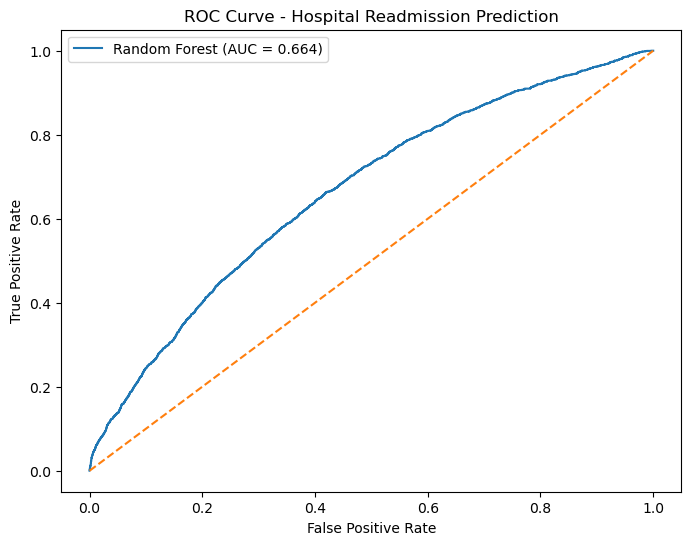

# Clinical Readmission Risk Analytics

## Project Overview

This project develops a machine learning model to predict hospital readmission risk using patient clinical data from the Diabetes 130-US Hospitals dataset.

Hospital readmissions are a major challenge for healthcare systems because they increase treatment costs, place additional pressure on hospital resources, and may indicate poorer patient outcomes. Early identification of patients at high risk of readmission can help healthcare providers implement targeted interventions and improve quality of care.

This project demonstrates an end-to-end healthcare machine learning workflow, including data preprocessing, feature engineering, model development, evaluation, and interpretation of clinical risk factors.

---

## Problem Statement

Hospital readmissions are associated with increased healthcare expenditure and reduced patient quality of life. Predicting which patients are likely to be readmitted enables hospitals to:

* Improve discharge planning
* Allocate healthcare resources efficiently
* Reduce avoidable readmissions
* Improve patient outcomes

The objective of this project is to build a machine learning model capable of identifying patients at increased risk of hospital readmission using demographic, clinical, and hospital utilisation variables.

---

## Dataset

### Source

Diabetes 130-US Hospitals Dataset

### Dataset Characteristics

The dataset contains over 100,000 hospital encounters collected from multiple hospitals in the United States.

### Variables Included

* Patient demographics
* Admission information
* Discharge information
* Diagnosis categories
* Medication usage
* Laboratory procedures
* Length of hospital stay
* Previous inpatient visits
* Previous emergency visits

---

## Project Structure

Clinical-Readmission-Risk-Analytics/

├── data/

│   ├── diabetic_data.csv

│   ├── diabetic_data_processed.csv

│   └── IDS_mapping.csv

│

├── notebooks/

│   ├── 01_Data_Understanding.ipynb

│   ├── 02_Data_Preprocessing.ipynb

│   ├── 03_Random_Forest.ipynb

│   ├── 04_Model_Evaluation.ipynb

│   └── 05_Project_Summary.ipynb

│

├── models/

│   └── final_random_forest_model.pkl

│

├── images/

│   ├── ROC.png

│   └── Feature_Importance.png

│

└── README.md

---

## Methodology

### 1. Data Understanding

Initial exploration of the dataset included:

* Dataset structure assessment
* Missing value analysis
* Variable inspection
* Class distribution evaluation

### 2. Data Preprocessing

Preprocessing steps included:

* Handling missing values
* Removing irrelevant variables
* Feature engineering
* Encoding categorical variables
* Creating train-test datasets

### 3. Model Development

A Random Forest Classifier was selected because it:

* Handles mixed data types effectively
* Captures non-linear relationships
* Is robust to overfitting
* Provides feature importance measures

### Model Parameters

* n_estimators = 300
* max_depth = 10
* min_samples_split = 10
* class_weight = balanced
* random_state = 42

---

## Model Performance

### Evaluation Metrics

| Metric   | Value |
| -------- | ----- |
| Accuracy | 0.67  |
| Recall   | 0.55  |
| ROC-AUC  | 0.664 |

### Interpretation

The balanced Random Forest model improved detection of readmission cases compared with the baseline model.

Although overall accuracy decreased compared with the original model, recall improved substantially, making the model more useful for identifying patients at risk of readmission.

In healthcare applications, identifying high-risk patients is often more important than maximizing overall accuracy.

---

## ROC Curve

The Receiver Operating Characteristic (ROC) curve evaluates the model's ability to distinguish between readmitted and non-readmitted patients.

---

## Feature Importance Analysis

Random Forest feature importance was used to identify the strongest predictors of hospital readmission.

### Top Predictive Features

1. number_inpatient
2. discharge_disposition_id
3. number_emergency
4. num_medications
5. time_in_hospital
6. number_diagnoses
7. num_lab_procedures
8. number_outpatient
9. num_procedures
10. admission_type_id

---

## Clinical Interpretation

The model suggests that patients are more likely to be readmitted when they have:

* Frequent previous inpatient admissions
* Multiple emergency department visits
* Longer hospital stays
* Greater medication burden
* More complex clinical histories

These findings are clinically plausible because patients with higher healthcare utilisation often have more severe or chronic health conditions requiring ongoing management.

---

## Limitations

Several limitations should be considered:

* Class imbalance remains a challenge.
* The dataset focuses primarily on diabetes-related admissions.
* External validation was not performed.
* Model performance could potentially be improved using advanced machine learning approaches.

---

## Future Work

Potential extensions of this project include:

* XGBoost implementation
* Hyperparameter optimisation
* Cross-validation strategies
* Explainable AI using SHAP values
* Deployment through Streamlit or Flask
* Comparison with Logistic Regression and Gradient Boosting models

---

## Technologies Used

* Python
* Pandas
* NumPy
* Scikit-Learn
* Matplotlib
* Joblib
* Jupyter Notebook

---

## Author

**Dr Shahbaz**

MSc Health Data Science and Statistics

University of Plymouth, United Kingdom

---

## Project Purpose

This project was developed as part of a healthcare machine learning portfolio to demonstrate practical skills in:

* Healthcare analytics
* Clinical data preprocessing
* Machine learning model development
* Model evaluation and interpretation
* End-to-end data science workflows
